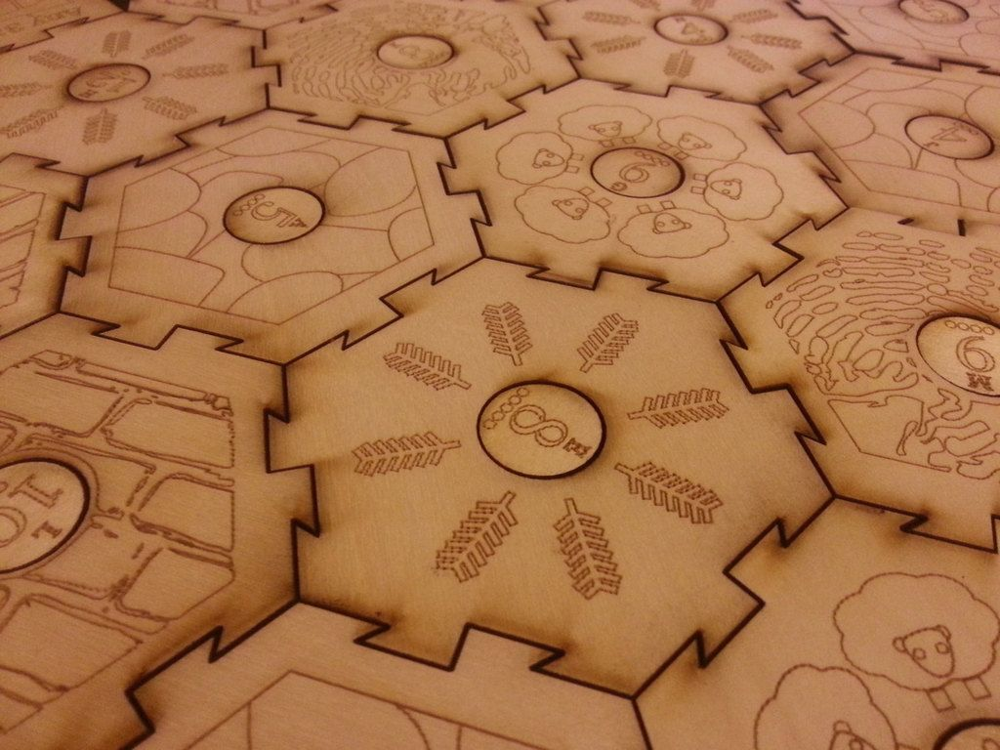

# Catan Board
## Files
`catan_complete_board.ai` includes:
* 19 Terrain Hexes
 	* 4 Forest
 	* 4 Fields (grain)
 	* 4 Pasture (wool)
 	* 3 Mountains (ore)
 	* 3 Hills (brick)
 	* 1 Desert
* Frame
* 18 circular number tokens
* 4 "Building costs" Cards
* 2 Special cards
	* "Longest Road" and "Largest Army"
* 16 Cities (33 spare)
	* 4 of each color
* 20 Settlements (29 spare)
	* 5 each color
* 60 roads (73 spare)
	* 15 each color

`instructions.pdf` includes:
* Instructions

`cards.pdf` includes:
* 95 Resource Cards
	* 19 grain
	* 19 wool
	* 19 ore
	* 19 brick
* 25 Developement Cards
	* 14 Knight
	* 6 Progress
		* 2 Invention
		* 2 Monopoly
		* 2 Roads
	* 5 Victory Point
		* Church, Library, University, Market, Town hall.

`yo.mama` includes:
* 1 Robber piece
* 2 dice

## Building
1. Go to your local laser cutting place. Most colleges and universities have one and offer discounts for students.
2. Download `catan_complete_board.ai` and laser cut it.
3. Print the pdfs in high quality material.

[OP](https://www.thingiverse.com/thing:5727)