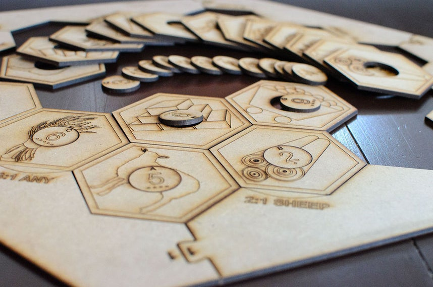

# Catan Board
## Files
`catan_complete_board.ai` includes:
* 19 Terrain Hexes
 	* 4 Forest
 	* 4 Fields (grain)
 	* 4 Pasture (wool)
 	* 3 Mountains (ore)
 	* 3 Hills (brick)
 	* 1 Desert
* Frame
* 18 circular number tokens
* 4 "Building costs" Cards
* 2 Special cards
	* "Longest Road" and "Largest Army"
* 16 Cities (33 spare)
	* 4 of each color
* 20 Settlements (29 spare)
	* 5 each color
* 60 roads (73 spare)
	* 15 each color

`instructions.pdf` includes:
* Instructions

`cards.pdf` includes:
* 95 Resource Cards
	* 19 grain
	* 19 wool
	* 19 ore
	* 19 brick
* 25 Developement Cards
	* 14 Knight
	* 6 Progress
		* 2 Invention
		* 2 Monopoly
		* 2 Roads
	* 5 Victory Point
		* Church, Library, University, Market, Town hall.

`yo.mama` includes:
* 1 Robber piece
* 2 dice

## Building
1. Go to your local laser cutting place. Most colleges and universities have one and offer discounts for students.

Here is how to use them:
Open the "Catan-ScoresOnly" file. Set your laser settings such that they will only cut partway through your material. If the recommended settings for your material say to use a speed of 35 and a power of 90, for example, you could either change your speed to 90 (so that the laser moves faster and thus doesn't have time to cut as deep) or change your power to 35 (so that the laser doesn't cut as deep as it moves). Start the laser. Scoring took my laser 5-10 minutes on 1/8" MDF.
Open the "Catan-CutsOnly" file. Set your laser settings such that they will cut all the way through the material. In my case, I used the same settings as I did for scoring, but repeated the cuts twice in order to cut all the way through. Cutting took my laser 10-15 minutes on 1/8" MDF.
Optionally, some laser cutters allow you to set different speed and power settings based on color. If you want to do this, use the "Catan-Cuts&Scores" file.
That's it. Stay tuned for more instructables on making cards, game pieces, and a better box to hold everything. Have fun!

2. Download `catan_complete_board.ai` and laser cut it.
3. Print the pdfs in high quality material.

[OP](https://www.instructables.com/id/Super-Simple-Settlers-of-Catan-Board/)